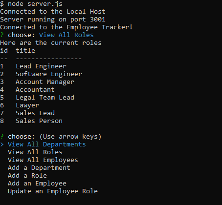

# Employee Tracker

 
  
## Description
My motivation for this project was to create an app for keeping track of your employees and their roles and salaries within the company. The app also allows the user to update the job positions with new roles as well as update the employees and add new employees to the new roles which you have created.

## Table of Contents

- [Installation](#installation)
- [Usage](#usage)
- [Credits](#credits)
- [License](#license)

## Installation

To install the project, you must have vs code, install node, mysql2, and express.

## Usage

You use this project by opening your command line and typing npm start. Then you may choose and option and begin adding or updating roles and employees.

    

## Credits

## License

## Questions

Please reach out to me on my [GitHub](github.com/wolaki96) or my email at wolaki96@gmail.com if you have any questions!

